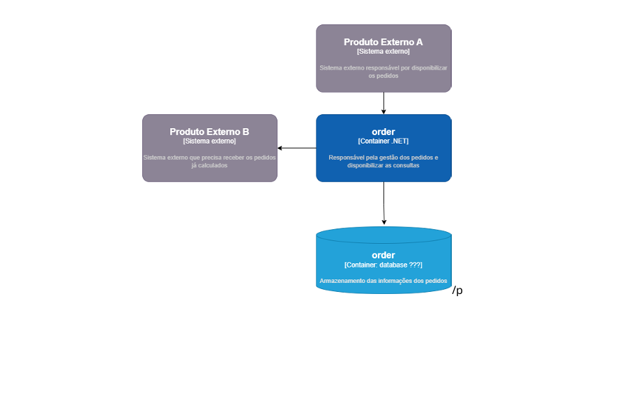
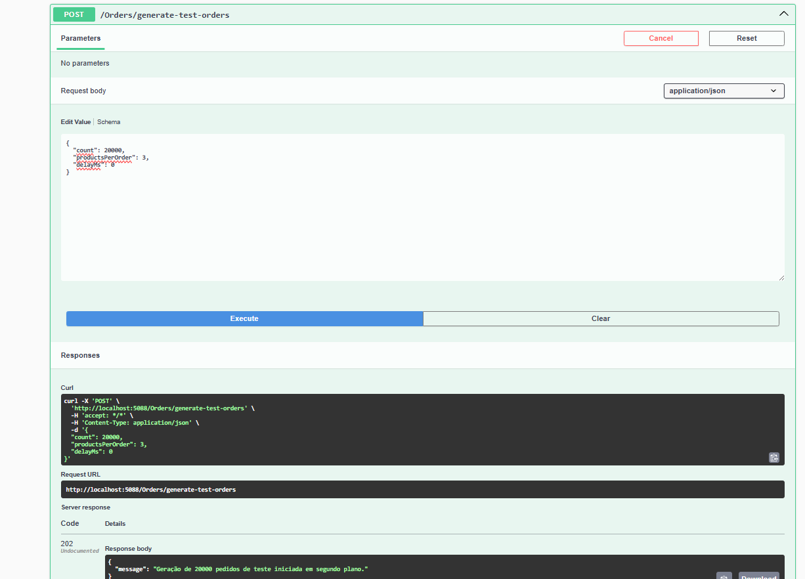
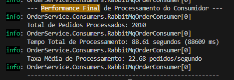

# AMBEV Order Service

Este projeto implementa um serviço de gerenciamento de pedidos de alta performance, projetado para lidar com uma volumetria significativa (150-200 mil pedidos/dia), garantindo alta disponibilidade, consistência de dados e escalabilidade. A solução emprega uma arquitetura assíncrona orientada a mensagens com o padrão CQRS (Command Query Responsibility Segregation).

## Visão Geral da Arquitetura

O sistema é composto por três componentes principais e um banco de dados, orquestrados por uma fila de mensagens:

1.  **Order Ingestion API (`OrdersController` - `POST /orders`):** Recebe os pedidos do Sistema Externo A e os publica imediatamente em uma fila de mensagens. Retorna `202 Accepted` para garantir a responsividade em alta carga.
2.  **Message Broker (RabbitMQ):** Atua como um buffer durável, garantindo que os pedidos sejam enfileirados de forma segura e distribuídos para os consumidores.
3.  **Order Processor (Worker Service - `RabbitMqOrderConsumer`):** Consome as mensagens da fila, processa a lógica de negócio (cálculo de valor, verificação de duplicidade) e persiste os dados no banco de dados.
4.  **Database (PostgreSQL):** Armazena os pedidos processados, garantindo consistência e integridade dos dados.
5.  **Order Query API (`OrdersController` - `GET /orders`, `GET /orders/{externalId}`):** Fornece endpoints otimizados para o Sistema Externo B consultar os pedidos já processados.

**Diagrama da Arquitetura:**
 


## Como Executar o Projeto

Para executar o projeto localmente, você precisará ter o [Docker](https://www.docker.com/get-started/) instalado e rodando.

1.  **Clone o repositório:**
    ```bash
    git clone https://github.com/luigibreda/AMBEV-OrderService
    cd AMBEV-OrderService
    ```
2.  **Configure o arquivo `appsettings.json` (se necessário):**
    Verifique a string de conexão do PostgreSQL. Por padrão, ele usa `Host=localhost;Port=5432;Database=ambev_orders;Username=admin;Password=admin`. Se você mudou as credenciais do PostgreSQL no `docker-compose.yml`, ajuste aqui.

    **Importante:** Para logs de console limpos e focados na performance, certifique-se de que no `appsettings.json` ou `appsettings.Development.json` você tenha:
    
    ```json
    {
    "Logging": {
        "LogLevel": {
        "Default": "Information",
        "Microsoft.AspNetCore": "Warning",
        "Microsoft.EntityFrameworkCore": "Warning",
        "Microsoft.EntityFrameworkCore.Database.Command": "Warning"
        }
    },
    "ConnectionStrings": {
        "DefaultConnection": "Host=localhost;Port=5432;Database=ambev_orders;Username=admin;Password=admin"
    },
    "AllowedHosts": "*"
    }
    ```

3.  **Inicie os serviços com Docker Compose:**
    ```bash
    docker-compose up --build
    ```
    Isso irá construir as imagens Docker e iniciar todos os contêineres necessários. Aguarde alguns segundos até que todos os serviços estejam em execução.

4.  **Acesse o Swagger UI:**
    `https://localhost:[PORTA_DA_SUA_APLICACAO]/swagger` (Ex: `https://localhost:7123/swagger`)

5.  **Acesse o RabbitMQ Management UI:**
    `http://localhost:15672` (Usuário: `guest`, Senha: `guest`)

---

## Demonstração da Viabilidade e Escalabilidade: Provas e Métricas de Performance

Esta seção apresenta evidências concretas da capacidade do sistema em lidar com alta volumetria, garantindo disponibilidade, consistência e evitando gargalos.

### Cenário de Teste: Simulação de Carga Massiva

Para validar a solução, utilizamos o endpoint de teste `POST /orders/generate-test-orders` para simular a ingestão de um grande número de pedidos em um curto período (`delayMs: 0` para simular burst).

**Passos para Replicar (Opcional, mas recomendado para a apresentação):**

1.  Inicie todos os serviços (`docker-compose up`).
2.  Acesse o Swagger UI e envie uma requisição para `POST /orders/generate-test-orders` com um `count` elevado (ex: 50000, 100000) e `delayMs: 0`.
3.  Monitore os logs no terminal e o RabbitMQ Management UI.
4.  Após a conclusão da simulação, **pare os serviços (`Ctrl+C` no terminal ou `docker-compose down`)** para que as métricas de performance final sejam logadas.

### 1. Alta Disponibilidade e Responsividade da Ingestão

**Evidência:** A API de ingestão (`OrdersController`) permanece totalmente responsiva, retornando `202 Accepted` imediatamente, enquanto a carga de trabalho é assincronamente transferida para a fila.

 

### 2. Consistência de Dados e Gerenciamento de Duplicatas

A arquitetura garante que, mesmo sob carga intensa e possíveis re-entregas de mensagens, os dados no banco de dados permanecem únicos e consistentes.

**Evidência:** O `RabbitMqOrderConsumer` possui lógica idempotente e o banco de dados possui uma restrição de unicidade (`UNIQUE INDEX` no `ExternalId`), garantindo que pedidos duplicados sejam identificados e não persistidos novamente.

 

### 3. Capacidade de Processamento e Ausência de Gargalos no Banco de Dados

A solução demonstra uma taxa de processamento robusta, superando o requisito médio de pedidos diários e provando a adequação do PostgreSQL.

**Evidência:** As métricas de performance logadas pelo `RabbitMqOrderConsumer` após o processamento da carga testam a capacidade do sistema.

 

*Captura de tela das métricas de performance do `RabbitMqOrderConsumer` após processar um lote de **2010** pedidos:*
-   **Total de Pedidos Processados:** 2010
-   **Tempo Total de Processamento:** 88.61 segundos (88609 ms)
-   **Taxa Média de Processamento:** 22.68 pedidos/segundo

**Análise dos Resultados:**

*   O requisito do desafio é de 150-200 mil pedidos por dia. Convertendo para uma média por segundo: `200.000 pedidos / (24 horas * 3600 segundos/hora) ≈ 2.31 pedidos/segundo`.
*   A taxa observada em ambiente de desenvolvimento (**22.68 pedidos/segundo**) é aproximadamente **10 vezes maior** do que a taxa média diária exigida. Isso demonstra que o sistema tem uma folga operacional considerável e é capaz de absorver picos de carga intensos, operando muito acima da média necessária.
*   O PostgreSQL, com a indexação adequada (`UNIQUE INDEX` no `ExternalId` e índice na `OrderId`), mostrou-se eficiente para as operações de escrita (inserções) e leitura (verificação de duplicidade) sob esta carga, sem sinais de gargalo.
*   Para volumes ainda maiores (excedendo significativamente 200 mil pedidos/dia), a arquitetura permite escalar horizontalmente adicionando mais instâncias do `RabbitMqOrderConsumer` e, se necessário, utilizando réplicas de leitura para o PostgreSQL para isolar a carga de consulta.

---

## Conclusão

Este serviço de gerenciamento de pedidos foi projetado e validado para atender aos desafios de alta volumetria, com foco em disponibilidade através do desacoplamento assíncrono, consistência de dados garantida por regras de negócio e banco de dados, e escalabilidade comprovada pela capacidade de processamento observada.