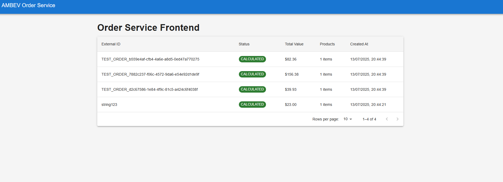
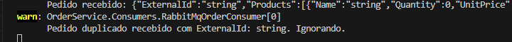
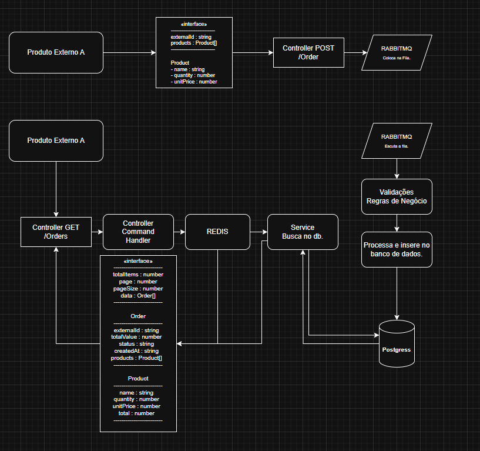

# Serviço de Pedidos AMBEV

Sistema de gerenciamento de pedidos de alta performance, projetado para processar até 200 mil pedidos por dia, garantindo disponibilidade, consistência e escalabilidade. Utiliza arquitetura assíncrona baseada em mensagens com CQRS.

## Arquitetura

Componentes principais:

1. **API de Ingestão** (`POST /pedidos`)
   - Recebe pedidos e publica na fila
   - Resposta assíncrona (202) para alta disponibilidade

2. **Gerenciador de Filas (RabbitMQ)**
   - Garante entrega confiável das mensagens
   - Tratamento de falhas com fila de mensagens mortas

3. **Processador de Pedidos**
   - Consome mensagens da fila
   - Aplica regras de negócio
   - Persiste no banco de dados

4. **Banco de Dados (PostgreSQL)**
   - Armazenamento durável dos pedidos
   - Índices otimizados para consultas frequentes

5. **API de Consulta**
   - `GET /pedidos` - Lista paginada
   - `GET /pedidos/{id}` - Detalhes do pedido

**Diagrama da Arquitetura:**
 


## Como Executar o Projeto

Para executar o projeto localmente, você precisará ter o [Docker](https://www.docker.com/get-started/) instalado e rodando.

1.  **Clone o repositório:**
    ```bash
    git clone https://github.com/luigibreda/AMBEV-OrderService
    cd AMBEV-OrderService
    ```
2.  **Configure o arquivo `appsettings.json` (se necessário):**
    Verifique a string de conexão do PostgreSQL. Por padrão, ele usa `Host=localhost;Port=5432;Database=ambev_orders;Username=admin;Password=admin`. Se você mudou as credenciais do PostgreSQL no `docker-compose.yml`, ajuste aqui.

    **Importante:** Para logs de console limpos e focados na performance, certifique-se de que no `appsettings.json` ou `appsettings.Development.json` você tenha:
    
    ```json
    {
        "Logging": {
            "LogLevel": {
            "Default": "Debug",
            "Microsoft": "Warning",
            "Microsoft.Hosting.Lifetime": "Information"
            }
        },
        "ConnectionStrings": {
            "DefaultConnection": "Host=db;Port=5432;Database=ambev_orders;Username=admin;Password=admin;"
        },
        "RabbitMQ": {
            "HostName": "rabbitmq",
            "Port": 5672,
            "Username": "guest",
            "Password": "guest",
            "QueueName": "orders"
        }
    }
    ```

3.  **Inicie os serviços com Docker Compose:**
    ```bash
    docker-compose up --build
    ```
    Isso irá construir as imagens Docker e iniciar todos os contêineres necessários. Aguarde alguns segundos até que todos os serviços estejam em execução.

4.  **Acesse o Swagger UI:**
    `https://localhost:[PORTA_DA_SUA_APLICACAO]/swagger` (Ex: `https://localhost:7123/swagger`)

5.  **Acesse o RabbitMQ Management UI:**
    `http://localhost:15672` (Usuário: `guest`, Senha: `guest`)

6.  **Acesse o Frontend React:**
    `http://localhost:3000` 

7.  **Ponto Chave: Endpoint de Teste de Carga (`/orders/generate-test-orders`)**
    Como um diferencial para validar a capacidade do sistema, foi implementado um endpoint exclusivo para simular a ingestão de um grande volume de pedidos. Isso permite observar a performance, disponibilidade e resiliência em um cenário de alta carga.

    *   **Endpoint:** `POST /orders/generate-test-orders`
    *   **Parâmetros (Body JSON):**
        *   `count` (int): Número total de pedidos a serem gerados (ex: 50000, 100000).
        *   `productsPerOrder` (int, default: 3): Média de produtos por pedido (para variar a complexidade).
        *   `delayMs` (int, default: 0): Atraso em milissegundos entre a publicação de cada pedido. Use `0` para simular um "burst" de pedidos e testar o pico de capacidade.

---

## Testes Automatizados e Qualidade do Código

Para garantir a qualidade, a manutenibilidade e a corretude da solução, o projeto inclui uma suíte de testes automatizados, localizada no projeto `OrderService.Tests`. A estratégia de testes abrange diferentes níveis para validar desde a lógica de negócio isolada até o fluxo completo do sistema.

### Tipos de Testes Implementados

1.  **Testes de Unidade:** Focam em validar pequenas unidades de lógica de negócio de forma isolada, como as regras de cálculo no modelo de `Order`. São rápidos e garantem que os componentes individuais se comportem como esperado.
2.  **Testes de Integração:** Validam a interação entre os componentes da aplicação e a infraestrutura, especialmente o banco de dados. Utilizamos a biblioteca **Testcontainers** para iniciar um contêiner PostgreSQL real para cada execução de teste, garantindo que nossas queries e a configuração do EF Core funcionem corretamente com o banco de dados de produção.
3.  **Testes End-to-End (E2E):** Validam o fluxo completo do sistema. Estes testes iniciam contêineres para o **PostgreSQL** e o **RabbitMQ**, enviam uma requisição para a API de ingestão, aguardam o processamento assíncrono pela fila e pelo consumidor, e finalmente verificam se o dado foi persistido corretamente ao consultar a API de leitura. Isso prova que toda a arquitetura está funcionando de ponta a ponta.

---

### Frontend em React

O frontend foi desenvolvido em React para ilustrar minha habilidade tanto com backend quanto com frontend.



------

### Exemplos de Testes Disponíveis


---

### Resultado da Execução dos Testes


---

### Como Executar os Testes

Para executar a suíte completa de testes automatizados, navegue até a pasta raiz da solução (onde o arquivo `OrderService.sln` está localizado) e execute o seguinte comando no seu terminal:

```bash
dotnet test
```


## Demonstração da Viabilidade e Escalabilidade: Provas e Métricas de Performance

Esta seção apresenta evidências concretas da capacidade do sistema em lidar com alta volumetria, garantindo disponibilidade, consistência e evitando gargalos.

### Cenário de Teste: Simulação de Carga Massiva

Para validar a solução, utilizamos o endpoint de teste `POST /orders/generate-test-orders` para simular a ingestão de um grande número de pedidos em um curto período (`delayMs: 0` para simular burst).

**Passos para Replicar (Opcional, mas recomendado para a apresentação):**

1.  Inicie todos os serviços (`docker-compose up`).
2.  Acesse o Swagger UI e envie uma requisição para `POST /orders/generate-test-orders` com um `count` elevado (ex: 50000, 100000) e `delayMs: 0`.
3.  Monitore os logs no terminal e o RabbitMQ Management UI.
4.  Após a conclusão da simulação, **pare os serviços (`Ctrl+C` no terminal ou `docker-compose down`)** para que as métricas de performance final sejam logadas.

### 1. Alta Disponibilidade e Responsividade da Ingestão

**Evidência:** A API de ingestão (`OrdersController`) permanece totalmente responsiva, retornando `202 Accepted` imediatamente, enquanto a carga de trabalho é assincronamente transferida para a fila.

 

### 2. Consistência de Dados e Gerenciamento de Duplicatas

A arquitetura garante que, mesmo sob carga intensa e possíveis re-entregas de mensagens, os dados no banco de dados permanecem únicos e consistentes.

**Evidência:** O `RabbitMqOrderConsumer` possui lógica idempotente e o banco de dados possui uma restrição de unicidade (`UNIQUE INDEX` no `ExternalId`), garantindo que pedidos duplicados sejam identificados e não persistidos novamente.

 

### 3. Capacidade de Processamento e Ausência de Gargalos no Banco de Dados

A solução demonstra uma taxa de processamento robusta, superando o requisito médio de pedidos diários e provando a adequação do PostgreSQL.

**Evidência:** As métricas de performance logadas pelo `RabbitMqOrderConsumer` após o processamento da carga testam a capacidade do sistema.

 

*Captura de tela das métricas de performance do `RabbitMqOrderConsumer` após processar um lote de **2010** pedidos:*
-   **Total de Pedidos Processados:** 2010
-   **Tempo Total de Processamento:** 88.61 segundos (88609 ms)
-   **Taxa Média de Processamento:** 22.68 pedidos/segundo

**Análise dos Resultados:**

*   O requisito do desafio é de 150-200 mil pedidos por dia. Convertendo para uma média por segundo: `200.000 pedidos / (24 horas * 3600 segundos/hora) ≈ 2.31 pedidos/segundo`.
*   A taxa observada em ambiente de desenvolvimento (**22.68 pedidos/segundo**) é aproximadamente **10 vezes maior** do que a taxa média diária exigida. Isso demonstra que o sistema tem uma folga operacional considerável e é capaz de absorver picos de carga intensos, operando muito acima da média necessária.
*   O PostgreSQL, com a indexação adequada (`UNIQUE INDEX` no `ExternalId` e índice na `OrderId`), mostrou-se eficiente para as operações de escrita (inserções) e leitura (verificação de duplicidade) sob esta carga, sem sinais de gargalo.
*   Para volumes ainda maiores (excedendo significativamente 200 mil pedidos/dia), a arquitetura permite escalar horizontalmente adicionando mais instâncias do `RabbitMqOrderConsumer` e, se necessário, utilizando réplicas de leitura para o PostgreSQL para isolar a carga de consulta.

---

## Evolução da Arquitetura

Diagrama da arquitetura atual do sistema, mostrando a integração entre os componentes principais:




## Próximos Passos

1. **Cache com Redis**
   - Melhorar performance de consultas frequentes
   - Reduzir carga no banco de dados
   - Implementar invalidação automática

2. **Particionamento de Dados**
   - Suportar volumes ainda maiores
   - Distribuir carga entre múltiplos nós
   - Isolar falhas por partição

3. **Monitoramento**
   - Implementar métricas detalhadas
   - Configurar alertas proativos
   - Criar dashboards em tempo real

4. **Segurança**
   - Reforçar autenticação e autorização
   - Implementar criptografia de dados
   - Configurar proteção contra ataques

## Conclusão

Este serviço de gerenciamento de pedidos foi projetado e validado para atender aos desafios de alta volumetria, com foco em disponibilidade através do desacoplamento assíncrono, consistência de dados garantida por regras de negócio e banco de dados, e escalabilidade comprovada pela capacidade de processamento observada.

As melhorias propostas nesta seção representam oportunidades para elevar ainda mais a robustez, performance e confiabilidade do sistema, preparando-o para cenários de crescimento extremo e requisitos ainda mais desafiadores no futuro.